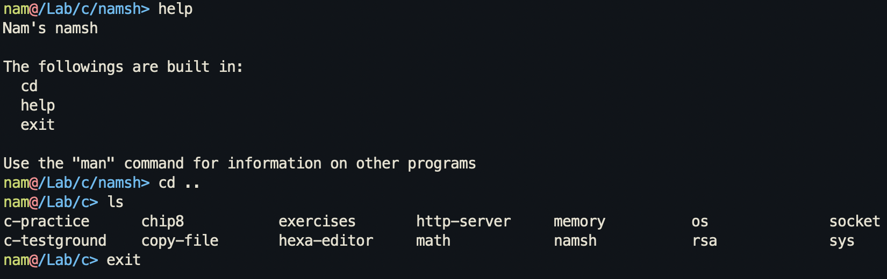

# namsh: The minimalist shell

A custom shell written in C

There are currently 4 builtin commands: `cd`, `help`, `exit`, and `history`

# Requirements

- [GCC](https://gcc.gnu.org/) or [Clang](https://clang.llvm.org/)
- [Make](https://www.gnu.org/software/make/)

# Compiling

| Command | Description |
| --- | --- |
| `make` | Compile and run the program |
| `make run` | Compile and run the program |
| `make compile` | Compile the program |
| `make clean` | Clean up the *obj* and *bin* directories |

# Documentation

You can find the documentation for how this project works on the [docs](docs/) directory
